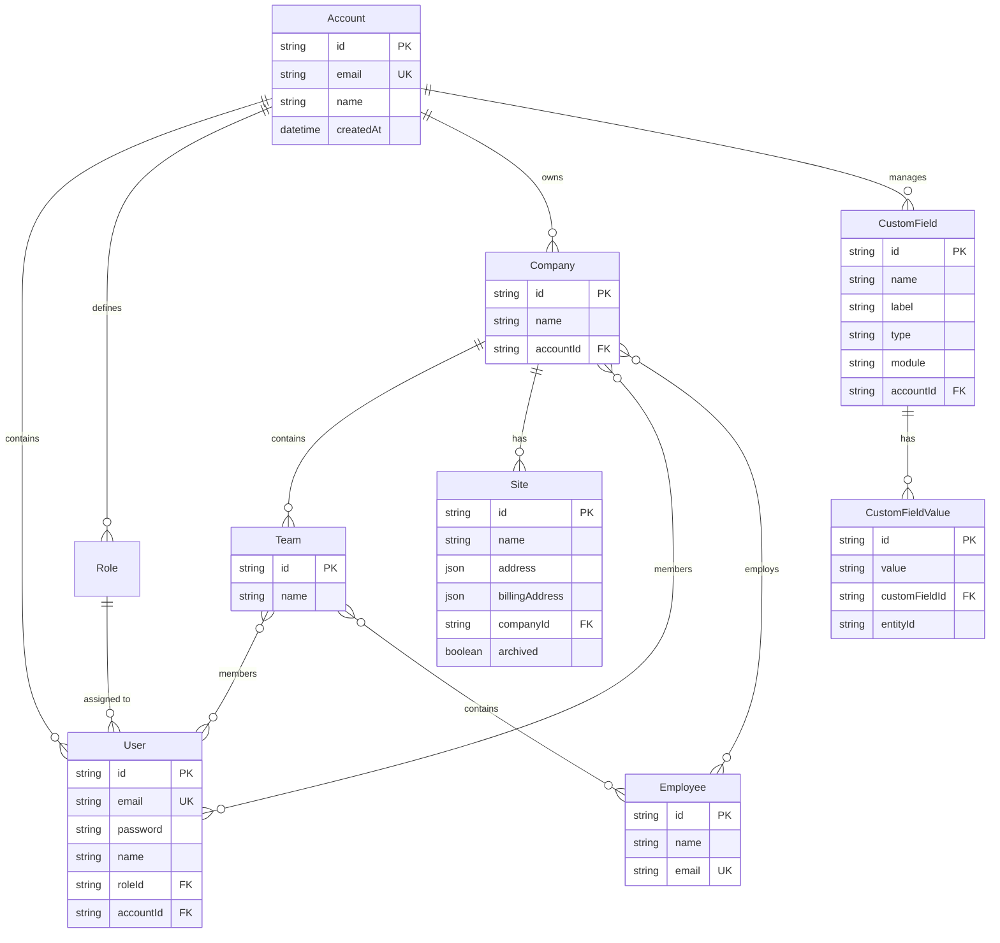

# FieldFlow Database Model

This document provides a detailed breakdown of the PostgreSQL database schema managed by Prisma.

## 📊 Entity Relationship Diagram (ERD)

## 🗂 Model Definitions

### 1. Account (Multi-Tenancy Root)
The **Account** table is the root of the multi-tenancy system. Every other entity (except Employees) is directly or indirectly linked to an Account.

### 2. User & Auth
- **User**: Represents a login identity. Linked to an `Account` and a `Role`.
- **Role**: Defines RBAC levels within an Account.

### 3. Organizational Structure
- **Company**: The primary organization entity.
- **Team**: Belong to companies and help organize Users/Employees.
- **Employee**: Represents a person in the system. Can belong to multiple companies and teams.

### 4. Site Locations
- **Site**: Specific physical locations linked to a Company. Stores complex address and contact data as JSON for flexibility.

### 5. Dynamic Custom Fields
- **CustomField**: Defined per module (`USER`, `SITE`, `COMPANY`) per Account.
- **CustomFieldValue**: Stores the actual dynamic data for a specific record.

---

## 🔗 Key Relationships
- **Many-to-Many**: 
  - `User <-> Company` (A user can be a member of multiple companies).
  - `User <-> Team` (A user can be in multiple teams).
  - `Employee <-> Company`
  - `Employee <-> Team`
- **One-to-Many**:
  - `Account -> Companies, Users, Roles`
  - `Company -> Sites`
  - `CustomField -> CustomFieldValues`
