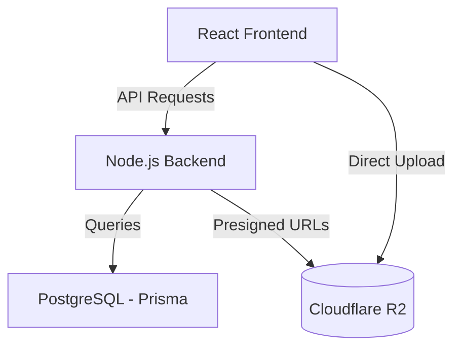

# FieldFlow — Full-Stack People Module

FieldFlow is a robust, multi-tenant people management system designed for organizations to manage companies, employees, teams, and site locations. It features a flexible "Custom Field" system allowing dynamic data collection across different modules.

## 🚀 Live Demo & Deployment
- **Backend**: [https://feildflow-backend.onrender.com](https://feildflow-backend.onrender.com)
- **Frontend**: [https://feildflow-frontend.onrender.com](https://feildflow-frontend.onrender.com) (Example URL)

---

## 🛠 Tech Stack

### Frontend
- **React (TS)**: Modern component-based UI.
- **Vite**: Ultra-fast build tool and dev server.
- **React-Bootstrap**: Professional, responsive layout components.
- **Axios**: Promised-based HTTP client for API communication.

### Backend
- **Node.js (Express)**: Scalable server-side logic.
- **TypeScript**: Type-safe development across the stack.
- **Prisma ORM**: Modern database abstraction for PostgreSQL.
- **JWT & Bcrypt**: Secure authentication and password hashing.
- **Cloudflare R2**: Secure, S3-compatible file and image storage.

### Database
- **PostgreSQL**: Reliable relational data storage.
- **Render Managed DB**: Production-grade hosting.

---

## 📊 Data Model (PostgreSQL)

The application uses an account-based multi-tenancy model. 

> [!TIP]
> **View the [Full Database Model & ER Diagram](./DATABASE_MODEL.md)** for detailed field definitions and relationship mappings.

### Core Entities
- **Account**: The top-level entity (Tenant). All data belongs to an Account.
- **User**: System users with login credentials, linked to an Account and a Role.
- **Role**: RBAC (Role-Based Access Control) definitions.
- **Company**: Organizations managed within an Account.
- **Site**: Specific locations linked to a Company, containing address and contact details.
- **Team**: Groups of employees and users.
- **Employee**: Individual staff members (can be linked to multiple companies/teams).

### Dynamic Data System
- **CustomField**: Defines dynamic fields (TEXT, NUMBER, SELECT, etc.) for a specific module (USER, SITE, etc.).
- **CustomFieldValue**: Stores the actual value of a custom field for a specific entity.

---

## 🏗 Architecture Overview



1.  **Multi-Tenancy**: Every database record is scoped to an `accountId`.
2.  **Auth Flow**: JWT-based stateless authentication.
3.  **File Storage**: Uses a **Presigned URL** flow. The backend generates a temporary secure link, and the browser uploads files directly to Cloudflare R2, ensuring privacy and reducing server load.

---

## ⚙️ Local Setup

1.  **Clone the Repo**:
    ```bash
    git clone https://github.com/ranbir12002/feildflow.git
    ```

2.  **Backend Setup**:
    ```bash
    cd backend
    npm install
    npx prisma generate
    # Fill in your .env variables (DATABASE_URL, JWT_SECRET, R2 credentials)
    npm run dev
    ```

3.  **Frontend Setup**:
    ```bash
    cd frontend
    npm install
    # Set VITE_API_URL in .env
    npm run dev
    ```

---

## 📄 Reference Docs
- [Deployment Guide](./deployment_guide.md)
- [Final Walkthrough & Fixes Registry](./walkthrough.md)
- [Project Tasks Tracking](./task.md)